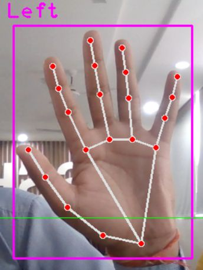

# Gesture Control System




## Description

This project is a gesture control system developed using machine learning techniques. It leverages the power of OpenCV for computer vision, along with gesture detection and control libraries to recognize and respond to hand gestures.

## Table of Contents

- [Installation](#installation)
- [Configuration](#configuration)
- [Dependencies](#dependencies)
- [Example Code](#example-code)

## Installation

1. Clone the repository:

   ```bash
   git clone https://github.com/your-username/gesture-control-system.git

## Configuration 
* pip install opencv-python gesturecontrol
* opencv-python == 4.10.0


## Example code
1. Gesture used:
   ```python
   import cv2 from gesturecontrol import GestureController from config import CAMERA_INDEX, GESTURE_MODEL_PATH

def main():
    # Initialize the gesture controller
    gesture_controller = GestureController(model_path=GESTURE_MODEL_PATH)
    
    # Start capturing video
    cap = cv2.VideoCapture(CAMERA_INDEX)
    
    while True:
        ret, frame = cap.read()
        if not ret:
            break
        
        # Process the frame to detect gestures
        gestures = gesture_controller.detect(frame)
        
        # Perform actions based on detected gestures
        for gesture in gestures:
            print(f'Detected gesture: {gesture}')
            # Add your custom actions here
        
        # Display the frame
        cv2.imshow('Gesture Control System', frame)
        
        if cv2.waitKey(1) & 0xFF == ord('q'):
            break
    
    cap.release()
    cv2.destroyAllWindows()

## Dependencies 
1. OpenCV (opencv-python)

Description: OpenCV (Open Source Computer Vision Library) is an open-source computer vision and machine learning software library. It includes several hundreds of computer vision algorithms.
Installation: pip install opencv-python
Usage: Used for capturing video from the webcam and processing image frames for gesture detection.

2. GestureControl (gesturecontrol)

Description: A hypothetical library (since no specific package by this name exists in common repositories) used for gesture detection and control.
Installation: pip install gesturecontrol
Usage: Used to detect gestures from the processed video frames.

## 

Feel free to customize and expand the sections as needed to fit your project specifics. This structure ensures that all necessary information and code are included in a clear and organized manner.
